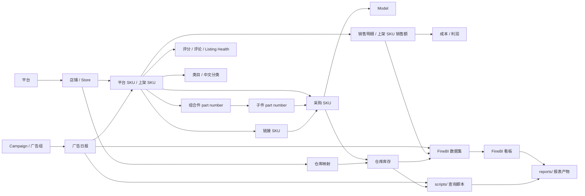

# 业务实体关系图

本文件记录当前项目中已经反复出现的业务实体及关系。第一版以 Wayfair、FineBI、库存、销售、广告为核心；未确认的跨平台关系标注为 `待核实`。

## 核心实体

| 实体 | 说明 | 主要用途 | 状态 |
| --- | --- | --- | --- |
| 平台 | Wayfair、Amazon、Overstock 等平台维度 | 销售、库存、广告、利润归因 | 部分已验证 |
| 店铺 / Store | 平台下的店铺或国家站点 | 过滤、国家仓库映射、FineBI 对账 | 部分已验证 |
| 平台 SKU / 上架 SKU | 平台侧展示和售卖 SKU | 广告、销售、库存有货率 | Wayfair 已验证较多 |
| Wayfair 销售 Supplier Part Number | `wf上架sku每日销售额.supplier_part`，销售源 Supplier Part Number / 销售 SKU 层；按产品管理可为 `Kit`、`Standard`、`Sellable Component` 或少量 `Nonsellable Component` | 总销售额回补、广告 SKU 月销售额、后续分摊入口 | 数据库复核 |
| 组合件 part number | `Product_Type=Kit` 的套组父件，或 Component 行 `Related_Kit_Part` 指向的父级 part number | 组合件销售额、组合件 -> 子件展开 | 业务确认 / 数据库复核 |
| 子件 part number | Wayfair 订单拆分后的最细 part number，例如 `总账单详情_extract.上架sku` | 子件销量、采购 SKU 组件拆分 | 业务确认 |
| 链接 SKU | Wayfair 有货率中用于链接层统计的 SKU | 链接 SKU 有货率 | 部分已验证 |
| 采购 SKU | 公司内部采购或库存 SKU | 库存、仓库、组合 SKU、Model 映射 | 部分已验证 |
| Model | 商品模型层级 | 商品聚合、销售分析、库存分析 | 待核实 |
| Campaign | 广告活动 / 广告组 | 广告表现分析 | Wayfair 已验证 |
| 类目 / 分类 | 商品分类、中文分类 | 类目分析、广告分组 | 部分已验证 |
| 仓库 | 国家仓、平台相关仓 | 可用库存、有货率 | 部分已验证 |
| FineBI 看板 / 数据集 | 业务可视化口径来源 | 对账、口径复核 | 部分已验证 |
| 报表产物 | `reports/` 下的 Excel、Markdown、HTML、图片 | 业务交付和复用 | 待核实索引状态 |

## 关系图

## 已知关系和风险

| 关系 | 当前理解 | 风险 |
| --- | --- | --- |
| Campaign -> 广告数据 | Wayfair 广告分析优先使用 `campaign_id`，`campaign_name` 只作展示。 | Campaign 名称可能变化，不能作为稳定主键。 |
| 上架 SKU -> 采购 SKU | Wayfair 有货率优先使用 `wayfair上架sku销售映射`，再回退 `平台产品详情表.采购sku`。2026-06-30 修正：Wayfair 销售额表 `supplier_part` 是销售源 Supplier Part Number / 销售 SKU 层，不是订单子件层；`wayfair上架sku销售映射.part_number` 是店铺 SKU / Supplier Part Number，可为 `Kit`、`Standard` 或 Component，并映射采购 SKU。 | 映射缺失或把销售 SKU / 子件 / 采购 SKU 混为同层级，会影响库存、有货率和销售归因。 |
| 组合件 -> 子件 | `wfproduct_management_latest` 的 Component 行提供 `Related_Kit_Part` 父件到 `Supplier_Part_Number` 子件的关系；`wf上架sku每日销售额.supplier_part` 只有在对应 `Kit` / 父件时才沿这条链路展开。 | 不能直接用 `supplier_part = 总账单详情_extract.上架sku`；组合件销售额分摊到采购 SKU 前必须先识别 Product_Type 并展开到子件。 |
| 采购 SKU -> Model | 已出现 `采购sku_model映射_2`。 | 全平台唯一性、一对多规则待核实。 |
| Store -> 国家仓库 | Wayfair 有货率需要按店铺对应国家仓库。 | 仓库映射变更会影响可用库存。 |
| 广告 SKU -> 总销售额 | 需在 SKU / 月 / 店铺粒度合并。 | 广告明细多行会导致总销售额重复。 |
| SKU -> 评分评论 | `detailed_listing_health` 用于评分评论。 | 存在重复记录风险，应 max / 去重，不能直接求和。 |
| 类目英文 -> 中文分类 | `wf_class中文分类` 将 `class_name` 映射到中文分类。 | 不能用其他产品类目字段替代。 |

## 待补关系

- 跨平台 SKU 到 Model 的统一主键规则。
- 订单明细、退款、利润、成本的完整字段血缘。
- FineBI 数据集到物理表的完整映射。
- 触发器、函数、事件任务对结果表的影响。
